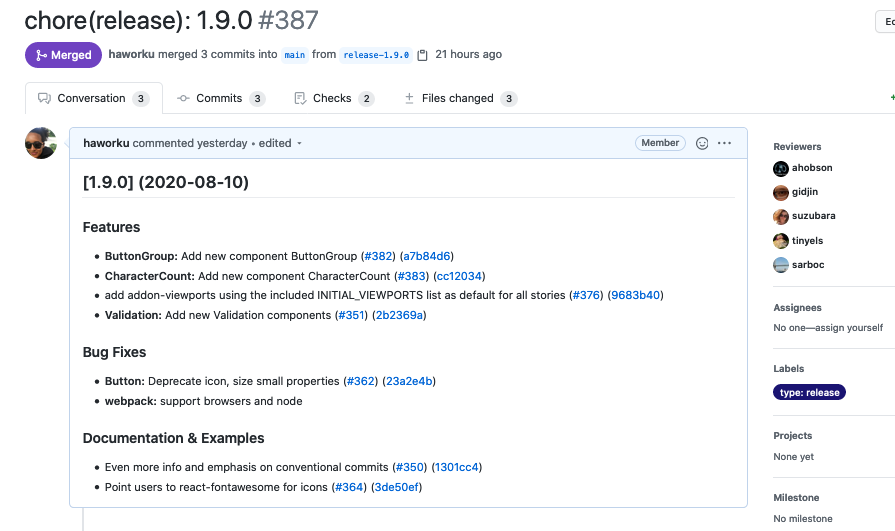

# Contributing

## Table of Contents

1. [Environment Setup](#environment-setup)
2. [Development](#development)
3. [Releasing](#releasing)

## Environment Setup

1. Clone this repo!

1. Use the node environment manager of your choice, but make sure you have the required version specified in `.node-version`. We recommend using [nodenv](https://github.com/nodenv/nodenv) to manage your node versions, but you can also use [homebrew](https://brew.sh/). More info can be found here: [how to install Node.js](https://nodejs.dev/how-to-install-nodejs)

1. Use [yarn](https://yarnpkg.com) to manage JS packages.

   - [Install yarn](https://yarnpkg.com/en/docs/install) if you do not already have it.
   - Type `yarn` or `yarn install` inside the project directory to install dependencies. You will need to do this once after cloning the project, and continuously if the dependencies in `package.json` change.

1. Make sure you can run all of the available commands listed below with no errors.

### Available Commands

These should all be run from within the project directory.

- `yarn storybook`
  - Starts Storybook server and watches for changed files
  - This will most likely be what you use for active development of components
- `yarn test`
  - Starts Jest test runner
  - `yarn test:watch` is also available
  - Use `yarn test:coverage` to generate a coverage report
- `yarn build`
  - Builds files from `/src` and outputs to `/lib` using webpack and UMD library target
  - `yarn build:watch` is also available
- `yarn example:install`
  - Installs dependencies for the example app. This must be run prior to viewing/developing the example application (located in `/example`).
  - Builds the library files from `/src` into `/lib`, and also runs `yarn install` in the `/example` directory
- `yarn example:start`
  - After installing dependencies, use this to start the example app dev server, so you can view the example app and also add to it.

## Development

To start working on a new issue, make sure you've assigned yourself to the issue in Github and marked it as "In Progress." Create a new branch off `develop` using the naming convention:

`{your initials or username}-{summary}-{issue #}`

For example: `sr-accordion-component-112`

See [adding new components](./adding_new_components.md) to get ideas of where to start.

### Pull Requests

When your branch is ready for review, open a PR into `develop` and request reviews from relevant team members. Reviews from codeowners will automatically be requested. Address any failing tests, lint errors, PR feedback, etc., and once your branch is approved you can squash & merge it into `develop`.

This project follows the [Conventional Commits](https://www.conventionalcommits.org/en/v1.0.0/#summary) specification. This standardizes contributions and streamlines the release flow. **All pull requests opened into `develop` or `master` must have a title that follows the [conventional commits spec](https://github.com/conventional-changelog/commitlint/tree/master/%40commitlint/config-conventional).** This generates an automated changelog entry and is required to merge.

(TODO) Passing `develop` builds will automatically be published to the `next` tag on NPM. This allows users to easily test out the latest version in their applications, which may be unstable.

### Dev Notes

Because this project exports a library that will be used by other projects, it is important that updates follow a set of standard practices. When you commit your changes, several hooks will run to check and format staged files. In order to be eligible for merging, all branches must pass testing and linting standards.

- [Prettier](https://prettier.io/), [TypeScript compilation](https://www.typescriptlang.org/), [eslint](https://eslint.org/) and [stylelint](https://stylelint.io/) are run on _staged files_ as a pre-commit hook
  - For an optimal developer experience, it's recommended that you configure your editor to run linting & formatting inline.
  - These checks will also be run on all files in CI, and must pass before the branch can be merged
- [`standard-version`](https://github.com/conventional-changelog/standard-version) is used during releases to auto-generate version numbers and changelog based on PR title.
  - The version number is determined based on conventional commits - **[fix]** indicates a bug fix, **[feat]** indicates a minor bump. **[!]** or [BREAKING CHANGES] indicates a major bump. Be sure to use the correct spec.
  - The **[WIP]** prefix can be used to indicate a pull request is still work in progress. In this case, the PR title is not validated and the pull request lint check remains pending.
  - We have set up [`commitizen`](https://commitizen.github.io/cz-cli/) CLI for making it easy to write standard commit messages. You can use `yarn commit` instead of `git commit` to start the commitizen prompt
- The project is configured to only allow [squash & merge](https://help.github.com/en/github/collaborating-with-issues-and-pull-requests/about-pull-request-merges#squash-and-merge-your-pull-request-commits) PR commits.
- [dangerjs](https://github.com/danger/danger-js) is used to enforce several pull request standards, including:
  - Changes to package source code should include changes to tests.
  - New `src/components` files should include changes to storybook.
  - New `src/components` files should be exported from the package entrypoint.
  - Package dependency changes should include `yarn.lock` updates and `yarn audit` outputs in PR description.
- All [Jest tests](https://jestjs.io/) will be run in CI and must pass before the branch can be merged
- [Happo.io visual regression tests](https://docs.happo.io/docs/reviewing-diffs) will be run in CI and all diffs must be approved before the branch can be merged. Developers must have access to the Happo.io account to approve/reject diffs. If you work at Truss, log into Happo.io with your gmail and you will be able to approve/reject changes. Navigate to the happo link for instructions on how to review and approve diffs.

## Releasing

Steps for a new release (these are in the process of being automated):

1. Check out `develop` and make sure you have pulled down the latest changes.

1. Run `yarn release` which uses [`standard-version`](https://github.com/conventional-changelog/standard-version) to:

   - Determine the new version based on new commits.
   - Generate a new entry in the changelog with the version, release notes, and today's date.
   - Commit all of the above changes
   - Note: Creating a new tag is **skipped** (this will happen as part of the publish flow)

1. Commit changes with message `chore(release): <version>`. Push changes to a new branch following the naming pattern: `release-<version>`

   - For example: `git checkout -b release-1.1.0`

1. Open a PR for the release branch against **`master`** (not `develop`, which is the default branch), with the new set of changes generated by the previous step included in the PR description. Resolve any conflicts.

   - Ask for approvals from stakeholders, perform testing on applications, etc.
   - Any hot fixes from testing or PR feedback can be made to the release branch directly if appropriate (use conventional commits syntax).

   

1. Once the release PR is approved, complete the release and publish the new version (this should be automated by GH - TODO):
   - Merge the PR into master.
     - Use **Rebase and Merge** option
   - Create a new [**release tag**](https://github.com/trussworks/react-uswds/releases) pointed at `master` on Github.
     - Use the same notes as release PR.
   - Publish the new package to npm: `npm publish`
     - Pull down latest `master` locally before publishing
     - Publishing access is limited to package owners. If you need access and don't have it, please contact `@npm-admins` on Truss Slack.
     - You may need to `npm login` first.

- Finish process by bringing develop branch back up to date.
  - Create a second PR from release branch back into develop. PR title should be`chore(release): <version>` **Squash and Merge.**
