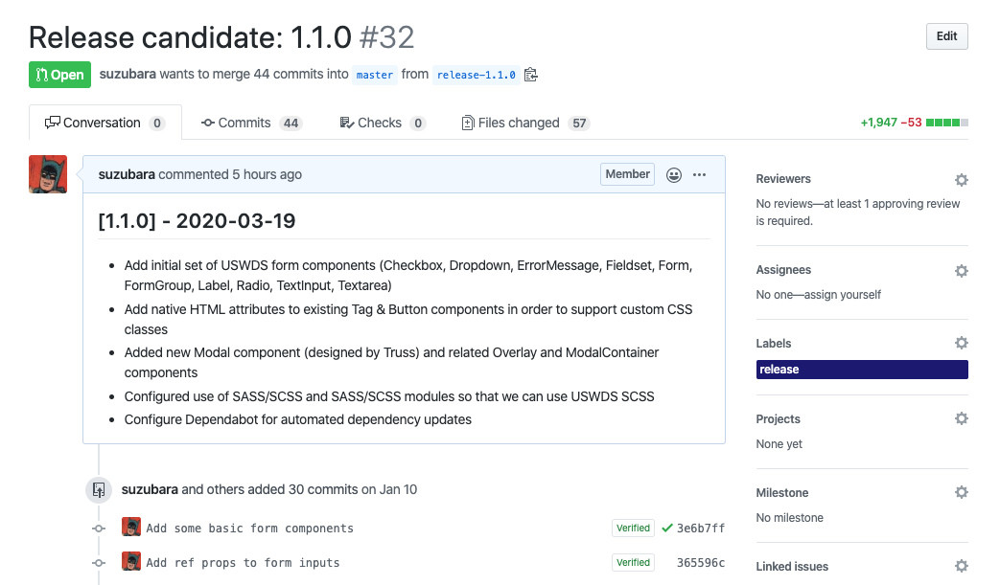

# Releasing

Steps for a new release (these are in the process of being automated):

1. Check out `main` and make sure you have pulled down the latest changes (`git pull origin main --tags`)

2. Run `yarn release` which uses [`standard-version`](https://github.com/conventional-changelog/standard-version) to:

   - Determine the new version based on new commit messages
   - Generate a new entry in the changelog with the version, release notes, and today's date.
   - Commit all of the above changes with the message `chore(release): <version>`

3. Push changes to a new branch following the naming pattern: `release-<version>`

   - For example: `git checkout -b release-1.1.0`

4. Open a PR for the release branch against `main`, with the changelog generated by the previous step included in the PR description.

   - PR title should be `chore(release): <version>`
   - Ask for approvals from stakeholders, perform testing on applications, etc.

   

5. Once the release PR is approved and merged, complete the release by publishing the new version:
      -  Create a new [**release**](https://github.com/trussworks/react-uswds/releases) on Github, pointed at the merge commit of the release PR. 
         - Look for the `Draft a new release` button.
         - Set the tag to the version number.  
         - Title your release with the version number. Use the same release notes as the release PR.
         - Point the release tag at the release merge commit by selecting `Recent Commits` from the `Target` dropdown in the Github UI. You should find the `chore(release): ...` commit at or near the top.
   - Download the tarbell for the release from the Github Action workflow
     - After merging the release PR, a [Github Actions workflow](../.github/workflows/package-release.yml) will build and package the release. You can find the action in the list by looking for "Package release". From the bottom of the workflow run's summary page, there is an artifacts section [where the artifact can be downloaded](https://github.com/actions/upload-artifact#where-does-the-upload-go).
     - The `.tgz` will be inside of the `artifact.zip`.
       - Archive Utility by default recursively unzips the `.tgz` file when unzipping the `artifact.zip`. If you wish to change this behavior, disable "Keep expanding if possible" in the Archive Utility preferences.
       - It may be easiest to use the terminal and run `unzip artifact.zip`.
   - [Publish](https://docs.npmjs.com/cli/v6/commands/npm-publish) the new package to npm: `npm publish <tarball>`. You will be prompted for a MFA code.
     - `<tarball>` should point to the `.tgz` obtained in the previous step.
     - You may need to `npm login` first.
     - Publishing access is limited to package owners. If you need access and don't have it, please contact `@npm-admins` on Truss Slack.
     - Note: While it would be desireable (and is very much possible) to automate the publishing step, there are security concerns with setting up an Automation Token for npm that would mandate maintaining a strict key rotation process, which at this time exceeds the commitment that maintainers have available. To keep consumers of React USWDS secure, this step remains manual.
  
## HELP  
 

       
Expand this section for instructions to make last minute bugfix

  <ul> 
  <li>For small bugfix, add commits on top of the existing release PR. Squash and merge the PR as usual.</li>
   
   <li>For significant bugfix you will need to redo the release process locally and redo your PR. Reset your local release branch, add bugfix commits (use conventional commits syntax). Rerun `yarn release`. The release chore commit should be the last commit on the branch. This way, the fix will be included in the changelog as a distinct commit. <i>Rebase and merge the PR </i>in this special case, so that the bugfix is maintained in the commit history.</li>
</ul>

 

   
Expand this section for manual publishing steps in the event CI is down.

     
   - **Ensure your working tree is clean** - Make sure there are no changes to your working directory and that no files are staged for commit. Be sure to remove any untracked files from your working directory as well.
   - **Fetch latest tag list**  - `git fetch --all --tags`
   - **Checkout the new release tag** - `git checkout 1.1.0` (replacing `1.1.0` with your tag)
   - **Rebuild app from scratch** - remove `node_modules` and run `yarn`, `yarn build`. If any errors occur, stop here.
   - **Publish the new package to npm** - `npm publish`.
 

